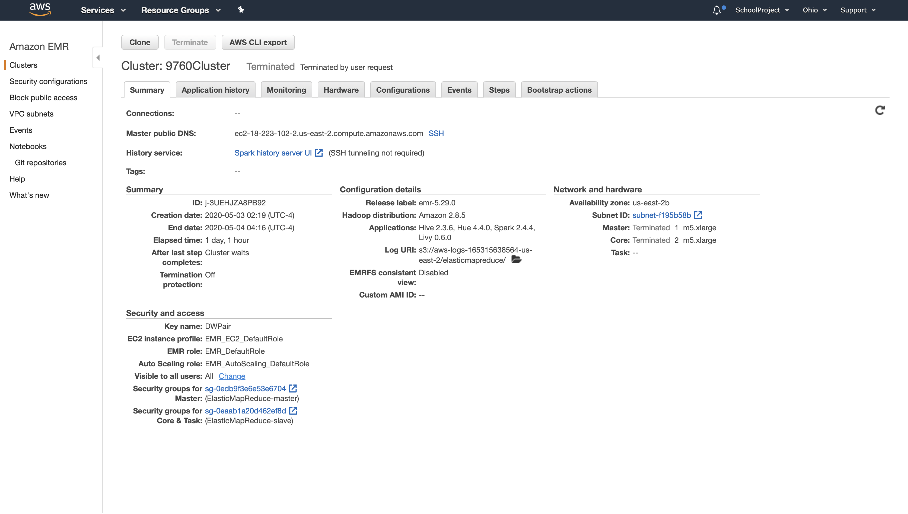
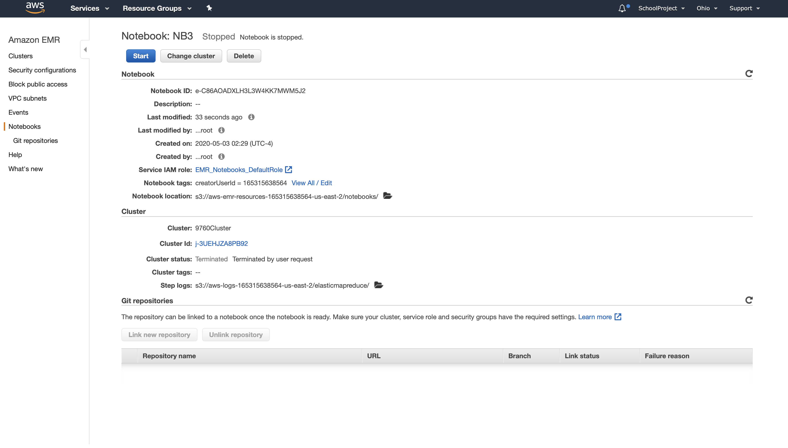

# STAT9760-Yelp_Analysis using Spark
We will analyze a subset of Yelp's business, reviews and user data. This dataset comes to us from Kaggle.

We will  analyzine several  different datasets and try to find out interesting data patterns:
1.  Top categories of businesses on yelp
2.  Whether writing a review and leaving a rating differs from  just leaving a rating
3.  Can elite members be trusted?

Tech used:  AWS EMR , AWS S3,  Jupyter Notebook

Screenshot 1 (Cluster Config):

Screenshot 2(NB Config):

